## 一、环境配置和初始代码拉取

我所做的操作系统是参考了xv6-riscv-2020，按照华东师范大学计算机科学与技术学院的操作系统课程实验https://gitee.com/xu-ke-123/ecnu-oslab-2025-task/tree/master/的实验过程和顺序来进行的。

初始的环境配置由于我之前学习MIT6.S081_xv6_labs已经搭建过了，所以在下载环境依赖和配置**qemu**的过程中并没有遇到什么问题。

按照建议，我创建了一个自己的**github**库https://github.com/sangjiyo/sang，用来保存这一次的实验代码，以及方便对每一次修改进行保存和管理。首先我就遇到了一个问题，在本地我创建的文件夹下，我直接拉取了华师大的lab1的代码框架，而后希望以此为起点，创建我自己的**lab-0**分支，合并提交到我自己的库中。就遇到了下面的第一个报错。

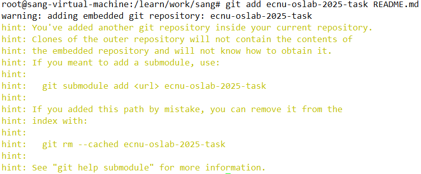

看到这个报错之后，我第一时间猜测可能是因为我直接在我的库中拉取了别人的库，合并时发生了一些冲突之类的，直接将报错信息提交给deepseek（我比较喜欢用这个的网页版）之后，果然跟我想的差不多。所以将这个仓库里的**.git**删掉就行了。还有一个**.gitignore**，用来在上传仓库的时候设置忽略哪些东西不要上传，一般是包含自己的密钥或者API-key等信息。


继续后续的上传仓库操作就没有问题了。

## 二、寻找内核启动的起点

lab-1的实验引导介绍中说了内核的启动过程是从**entry.S**到**start.c**到**main.c**，**entry.S**设置内核的起始物理地址，并为cpu分配栈空间，而后跳转到**start.c**开始执行，xv6-riscv-2020设计的是双核cpu启动，实现的方式是为每个cpu分配固定的空间，而后将第二颗cpu起始地址按照分配空间大小进行了一个偏移，确保两颗cpu互不干扰。

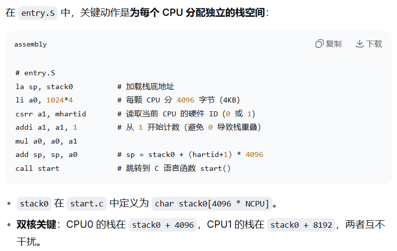

而后**start.c**（运行在机器模式M-mode，这个是什么）的工作主要是，将cpu从裸机状态推进到内核的监管者模式S-mode（这个又是什么），并且跳转到C语言的`main()`函数，关键代码和主要工作如下。

```  c
int id = r_mhartid();    // 切换到S-mode后无法访问M-mode的寄存器
w_tp(id);                // 所以需要将hartid存到可访问的寄存器tp
w_mepc((uint64)main);                  //设置返回地址
uint64 status = r_mstatus();
status &= ~MSTATUS_MPP_MASK;           
status |= MSTATUS_MPP_S;               //假装上一个模式是S-mode
w_mstatus(status);
w_satp(0);                             //明确关闭分页
asm volatile("mret");                  //触发特权级切换，进入S-mode模式，跳转到main()函数
```

而后由`main()`执行系统的初始化，并正式进入系统。但是在这里，我看到了一个文件**kernel.ld**

``` text
OUTPUT_ARCH( "riscv" )
ENTRY( _entry )
SECTIONS
{
  . = 0x80000000;
  .text : {
    *(.text .text.*)
    . = ALIGN(0x1000);
    /*
    _trampoline = .;
    *(trampsec)
    . = ALIGN(0x1000);
    ASSERT(. - _trampoline == 0x1000, "error: trampoline larger than one page");
    */
    PROVIDE(etext = .);
  }
  .rodata : {
    . = ALIGN(16);
    *(.srodata .srodata.*) /* do not need to distinguish this from .rodata */
    . = ALIGN(16);
    *(.rodata .rodata.*)
  }
  .data : {
    . = ALIGN(16);
    *(.sdata .sdata.*) /* do not need to distinguish this from .data */
    . = ALIGN(16);
    *(.data .data.*)
  }
  .bss : {
    . = ALIGN(16);
    *(.sbss .sbss.*) /* do not need to distinguish this from .bss */
    . = ALIGN(16);
    *(.bss .bss.*)
  }
  PROVIDE(end = .);
}
```


看到了它开头的`ENTRY(_entry)`，我觉得这个可能才是整个系统运行的起点，deepseek给出的答案如下：

**kernel.ld**是 xv6 内核的链接脚本（Linker Script）。它在整个启动流程中扮演着“总设计师”的角色——虽然它本身不产生任何运行的机器码，但它决定了内核可执行文件（kernel）在内存中的最终布局，并给内核源码提供了关键的边界符号。

虽然一上来看不太懂，但是这个文件好像主要是为内核的运行制定了一些规则，我的理解是这样的。

以上，我终于对整个操作系统的开头启动过程，有了一点粗略的理解。而在华师大的lab-1中第一个目标已经完成了，需要参考xv6的代码，填充完整当前的**start.c**。

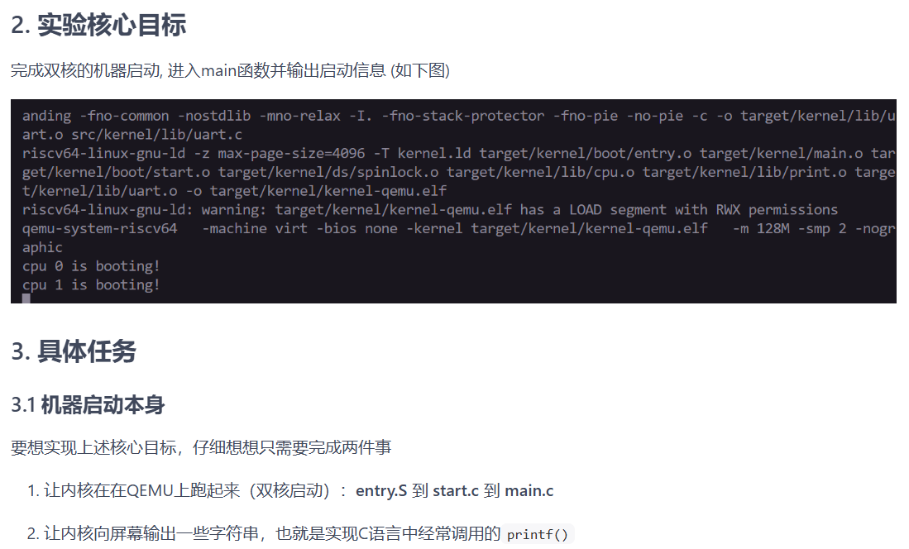

## 三、利用串口驱动完成print.c

利用当前代码中的串口，仿照xv6的`prntf`实现，补充完整当前的**print.c**这里我直接将**lab-1**的串口文件**uart.c**和需要填充的**print.c**发送给ds让它进行填充。

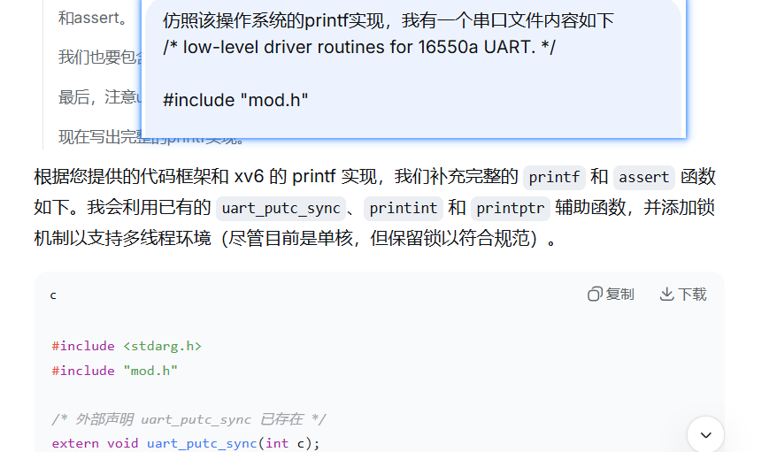

而后按照它给出的代码，对**print.c**进行补充。而后以`printf("Hello %s, pid=%d", "World", 42);`为例，对`printf`的工作流程，和代码作用进行分析

``` 
示例：printf("Hello %s, pid=%d", "World", 42);
    va_list ap;
    int i, c;
    char *s;
    //获取锁（防止多个CPU同时打印）
    spinlock_acquire(&print_lk);          #获取锁，防止多核输出乱序
    va_start(ap, fmt);                    #首先令ap指向第一个可变参数"World"
    for (i = 0; (c = fmt[i] & 0xff) != 0; i++) {  #for循环遍历fmt指向的字符串，在遇到%
        if (c != '%') {                           #之前，都直接调用发送串口uart_putc_sync
            uart_putc_sync(c);                    #对单字符进行输出
            continue;
        }
        // 处理 '%'
        c = fmt[++i] & 0xff;           #当遇到%的时候，读取下一个字符
        if (c == 0)                    #此时为s，进入case s分支
            break;
        switch (c) {
            case 'd':
                printint(va_arg(ap, int), 10, 1);
                break;
            case 's':
                s = va_arg(ap, char *);    #va_arg将第一个参数"World"的指针赋值给s后
                if (s == 0)                #自动将ap的指向调整到下一个参数42的位置
                    s = "(null)";
                while (*s)
                    uart_putc_sync(*s++);  #逐个取出"World"的字符进行输出
                break;                     #后续的输出同上
            case '%':
                uart_putc_sync('%');
                break;
            default:
                // 未知格式，原样输出 % 和字符
                uart_putc_sync('%');
                uart_putc_sync(c);
                break;
            }
        }
    va_end(ap);                             #输出完成之后将ap置空
    spinlock_release(&print_lk);            #释放锁

```


## 四、锁的实现

在完成`print`的内容后，回到实验目录我发现好像**spinlock.c**我还没有完成，下面要对锁机制进行实现。同样参考xv6进行，只不过这一次我选择不用ds。

``` c
// 自旋锁初始化
void spinlock_init(spinlock_t *lk, char *name)
{
    lk->name = name;
    lk->locked = 0;
    lk->cpuid = 0;
}

// 是否持有自旋锁
bool spinlock_holding(spinlock_t *lk)
{
    bool r;
    r = (lk->locked && lk->cpuid == mycpuid());
    return r;

}

// 获取自旋锁
void spinlock_acquire(spinlock_t *lk)
{
    push_off();
    if (spinlock_holding(lk))
        panic("acquire");
    while (__sync_lock_test_and_set(&lk->locked, 1) != 0);
    __sync_synchronize();
    lk->cpuid = mycpuid();
}

// 释放自旋锁
void spinlock_release(spinlock_t *lk)
{
    if (!spinlock_holding(lk))
        panic("release");
    lk->cpuid = 0;
    __sync_synchronize();
    __sync_lock_release(&lk->locked);
    pop_off();
}
```


好吧，还是遇到了一些问题，在仿照xv6写到这里时，我看到了一个新函数`__sync_lock_test_and_set`，但是不知道它是做什么的。

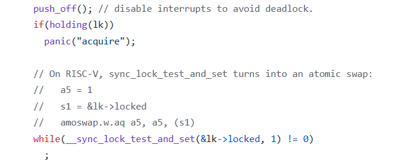

原来这些`__sync__*`函数不是需要我自己实现的，它是编译器的内建函数，在编译过程中会直接被替换为对应的**RISC-V**汇编指令。所以应当是可以直接拿来使用的。

完成了上面的代码之后，lab-1的任务已经接近尾声了，再完成**main.c**的内容，应该就可以实现系统的启动了。

## 五、完成main.c，实现系统初次启动

阅读了xv6的**main.c**之后，我发现在`main`函数中主要实现了一些初始化，然后打印输出一些内容，但是对于我正在做的这个系统，我不太清楚需要初始化的内容有哪些，借助ai分析应当是有必要的，所以我选择将我的所以代码上传给ai，让它对照xv6的内容，告诉我我的**main.c**中应该写什么东西。

``` c
#include "arch/mod.h"
#include "lib/mod.h"
// 全局标志：用于主核通知从核初始化已完成
volatile int started = 0;
int main()
{
    // 获取当前 CPU 的 hartid（由 start.c 保存在 tp 中）
    int cpu_id = mycpuid();
    if (cpu_id == 0) {
        // 主核（CPU0）负责初始化串口和 printf 锁
        print_init();
        // 内存屏障，确保之前的初始化操作对其它核可见
        __sync_synchronize();
        // 通知从核初始化完成
        started = 1;
    }
    else {
        // 从核（CPU1）等待主核完成初始化
        while (!started) {
            // 空循环等待，可考虑加入 wfi 指令（但无中断时效果相同）
        }
        // 确保读到 started 的最新值
        __sync_synchronize();
    }
    // 所有核打印启动信息
    printf("cpu %d is booting!\n", cpu_id);
    // 打印完成后进入死循环（后续可扩展为调度器）
    while (1) {
        // 可加入 wfi 指令降低功耗，但无中断时无影响
        // asm volatile("wfi");
    }
    return 0;
}

```

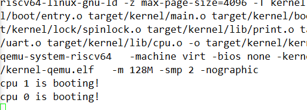

成功了，但是cpu1先打印的输出信息，明显需要进行一些同步，这里我选择修改在cpu0初始化完成并通知cpu1之前打印输出信息。

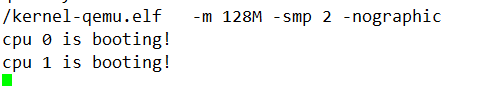

搞定！以上lab-1的内容已经全部完成，后续的lab内容我需要加快一下速度了，先将内容上传保存到我的仓库中。

## 六、物理内存和虚拟内存管理

这里需要完成物理内存的初始化，对物理内存进行分页，虚拟内存的初始化，对**页表(PTE)**和**页表项(pgtbl)**的管理分配。


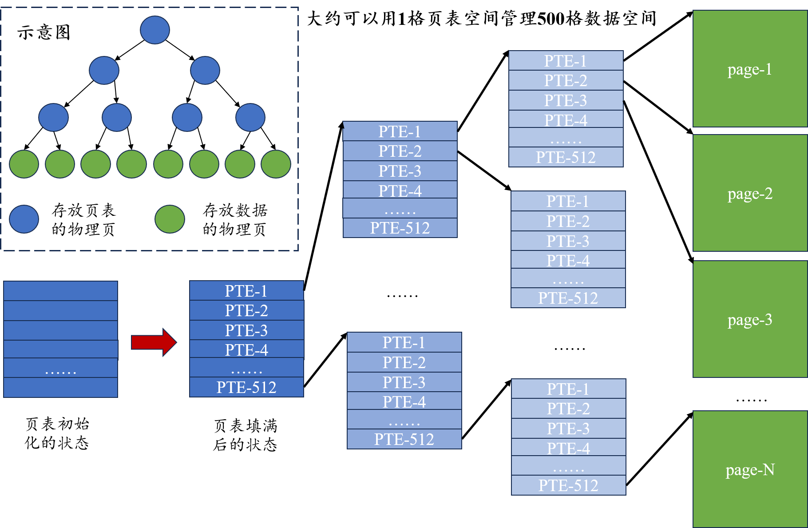

依旧是参考xv6的代码进行实验，在利用ai分析之后，我知道了xv6中进行物理内存和虚拟内存管理的分别是**kalloc.c**和**vm.c**文件，而后直接交给ds参照补全当前代码文件中负责物理内存和虚拟内存管理的**pmem.c**和**kvm.c**。

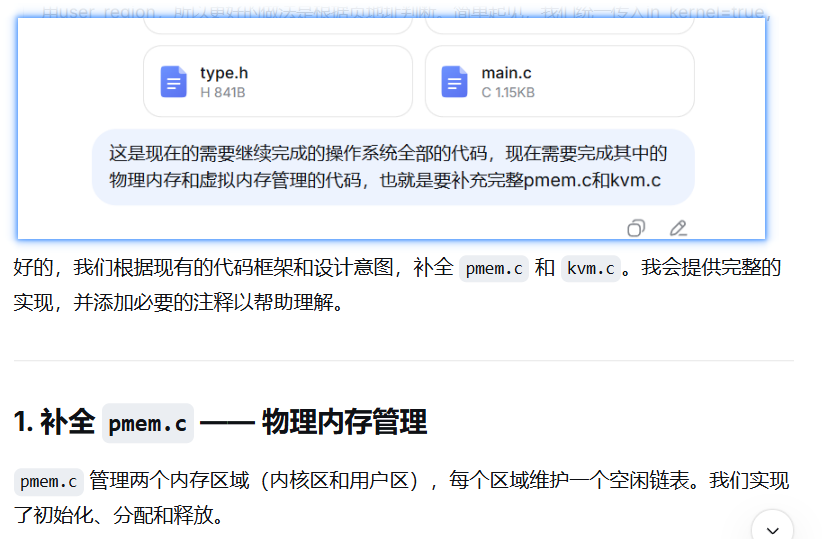

而后使用实验示例代码进行测试，紧接着就出现了一个耗费了很长时间才找到根源的问题。以下是测试代码的部分截图，问题就出现再框起来的地方。

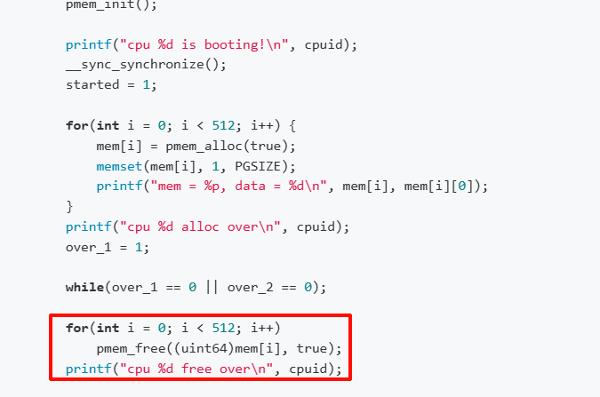

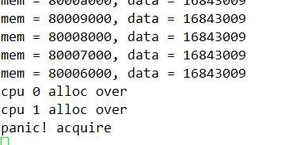

测试过程中，两个cpu再申请完内存之后，紧接着就出现了竞争锁的报错，我一开始以为是代码逻辑的问题，让ds分析代码问题，直到某一次让ds添加调试信息，在在`pmem_free`和`pmem_alloc`的进出口处添加日志输出代码，发现就能通过测试。

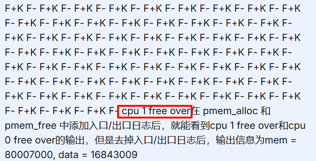

这里我敏锐的察觉到了问题，然后我将输出内容直接改成只输出一个空格，发现也还能成功通过测试，然后只在`pmem_free`的进口或者出口添加一处`uart_putc_sync(' ')`，还是能成功通过测试，虽然我不知道这是什么原因，但是在将这个现象描述给ds后，它给出了答案。

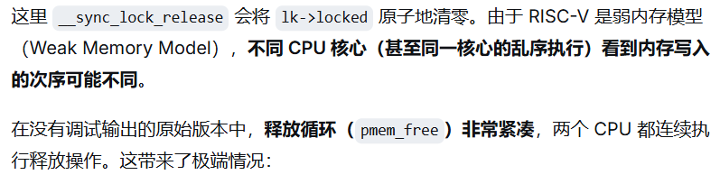

没错，代码没有问题，就是测试代码中，我框出来的那一部分，进行 `pmem_free`操作过于频繁，在RISC-V中就会出现问题。 物理内存管理已经实现。所有测试都能通过。而后进行的虚拟内存管理测试也没有什么太大的问题，实验指导中给的测试代码有一定的出入，需要做一些调整。

## 七、中断异常初步

在阅读完代码和这一部分的实验指导之后，我大概了解了中断的处理过程。不过在**RISC-V**中，有一个统筹的概念叫**陷阱(trap)**，不是太理解为什么这么叫，反正它就是用来统称**中断(interrupt)**和**异常(exception)**两种类型的。中断和异常都是对正常执行过程的一个打断，只不过前者可以预见，而后者是突发情况，还都涉及到特权级的陷入和返回，例如**U-mode**陷入**S-mode**再返回**U-mode**，或者同级切换（不是很理解）。不一样的地方在于，中断是在当前一个时钟周期完成之后的，所以中断处理完成后，会继续执行下一个指令；而异常则是不分情况的对当前指令流的一个突然打断，所以异常处理完成后还需要回来重新把当前的指令执行完成。说白了就是中断执行完回来继续做下一件事情，异常处理完还需要把刚刚被打断的事情重新做完整。

而在**trap.S**代码中可以看到，在处理中断的时候，会在内存中开辟一块空间，给到cpu中的通用寄存器，用来保存寄存器中的状态，在中断处理完成后，cpu从内存中恢复到中断之前的状态后，再将这块空间销毁。

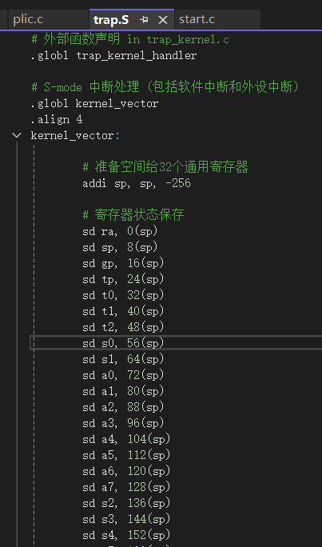

当前需要我完成的有**timer.c、trap_kernel.c、start.c、uart.c**，还是依旧参考xv6，让ds帮我分析。

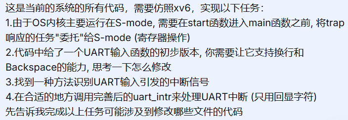

先做一个简单的，需要让`UART`函数支持**换行**和**Backspace**，要修改**uart.c**的`uart_intr`函数，增加一些功能。

``` c
// 中断处理(键盘输入->屏幕输出)
void uart_intr(void)
{
	while (1)
	{
		int c = uart_getc_sync();
		if (c == -1)
			break;

		// 处理回车：转换成换行并输出
		if (c == '\r') {
			uart_putc_sync('\r');
			uart_putc_sync('\n');
			continue;
		}
		// 处理退格（DEL 或 Backspace）
		if (c == '\b' || c == '\x7f') {
			uart_putc_sync('\b');
			uart_putc_sync(' ');
			uart_putc_sync('\b');
			continue;
		}
		// 普通字符直接回显
		uart_putc_sync(c);
	}
}
```

然后先仿照xv6的**start.c**进行修改一下

``` c
//...现有代码
// 将异常和中断委托给 S-mode
w_medeleg(0xffff);
w_mideleg(0xffff);
w_sie(r_sie() | SIE_SEIE | SIE_STIE | SIE_SSIE);

// 初始化时钟中断（必须在进入 S-mode 前设置好 M-mode 的中断向量）
timer_init();

// 设置M-mode的返回地址
w_mepc((uint64)main);
```

完善**timer.c**

``` c
// 时钟创建
void timer_create()
{
    spinlock_init(&sys_timer.lk, "sys_timer");
    sys_timer.ticks = 0;
}

// 时钟更新
void timer_update()
{
    spinlock_acquire(&sys_timer.lk);
    sys_timer.ticks++;
    spinlock_release(&sys_timer.lk);
}

// 获取滴答数量 (不把sys_timer暴露出去, 只提供安全的访问接口)
uint64 timer_get_ticks()
{
    uint64 ticks;
    spinlock_acquire(&sys_timer.lk);
    ticks = sys_timer.ticks;
    spinlock_release(&sys_timer.lk);
    return ticks;
}
```

完善**trap_kernel.c**

``` c
void trap_kernel_handler()
{
    //...已有的代码
    int trap_id = scause & 0xf;

    /* 高位bit标识了是中断还是异常 */
    if (scause & 0x8000000000000000ul) {
        // 1-中断处理
        switch (trap_id) // 中断产生原因分类
        {
        case 1:  // S-mode software interrupt（由 M-mode 时钟触发）
            timer_interrupt_handler();
            break;
        case 9:  // S-mode external interrupt（外设，如 UART）
            external_interrupt_handler();
            break;
        default: // 例外处理
            printf("\nunexpected interrupt: %s\n", interrupt_info[trap_id]);
            printf("trap_id = %d, sepc = %p, stval = %p\n", trap_id, sepc, stval);
            panic("trap_kernel_handler");
        }
    } else {
        // 2-异常处理...
    }
}
// 外设中断处理 (基于PLIC，lab-3只需要识别和处理UART中断)
void external_interrupt_handler()
{
    int irq = plic_claim();
    if (irq == UART_IRQ) {
        uart_intr();
        plic_complete(irq);
    }
    else {
        // 其他外设中断可后续扩展
        if (irq) plic_complete(irq);
    }
}
```

而后根据实验测试要求，让ds给我生成了测试用的**main.c**的代码

``` c
#include "arch/mod.h"
#include "lib/mod.h"
#include "mem/mod.h"
#include "trap/mod.h"

// 全局标志：用于主核通知从核初始化已完成
volatile static int started = 0;

// 测试模式：1-滴答测试（打印 ticks），2-多核 di da 测试 ， 3-输入输出测试
#define TEST_MODE 3        

int main()
{
    int cpuid = r_tp();

    if (cpuid == 0) {

        print_init();
        pmem_init();
        kvm_init();
        kvm_inithart();

        // 初始化 trap 子系统（PLIC、timer 锁、中断向量）
        trap_kernel_init();
        trap_kernel_inithart();

        printf("cpu %d is booting!\n", cpuid);
        __sync_synchronize();
        started = 1;

#if TEST_MODE == 1
        // 滴答测试：主核轮询 ticks 变化并打印
        uint64 last_ticks = 0;
        while (1) {
            uint64 now = timer_get_ticks();
            if (now != last_ticks) {
                printf("ticks = %d\n", now);
                last_ticks = now;
            }
            // 简单忙等待，保证中断能正常响应
            for (volatile int i = 0; i < 100000; i++);
        }
#elif TEST_MODE == 2
        // di da 测试：每次 ticks 增加时打印当前 CPU 标识
        uint64 last_ticks = 0;
        while (1) {
            uint64 now = timer_get_ticks();
            if (now != last_ticks) {
                printf("cpu %d:di da\n", cpuid);
                last_ticks = now;
            }
            for (volatile int i = 0; i < 10000000; i++);
        }
#endif

    }
    else {

        while (started == 0);
        __sync_synchronize();
        // ---------- 从核 trap 初始化 ----------
        trap_kernel_inithart();

        printf("cpu %d is booting!\n", cpuid);

#if TEST_MODE == 2
        // 从核也参与 di da 打印
        uint64 last_ticks = 0;
        while (1) {
            uint64 now = timer_get_ticks();
            if (now != last_ticks) {
                printf("cpu %d:di da\n", cpuid);
                last_ticks = now;
            }
            for (volatile int i = 0; i < 10000000; i++);
        }
#else

        // 从核可以进入低功耗循环或执行其他任务
        while (1) {
            // 可加入 wfi 指令降低功耗
            // asm volatile("wfi");
        }
#endif

    }
    return 0;
}
```

成功实现了时钟的测试

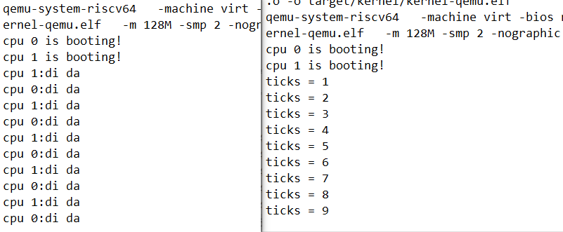

成功实现了输入显示，退格，换行的逻辑

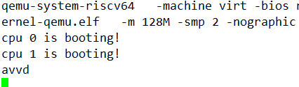

## 八、第一个用户进程

完成内核的基础建设之后，就要开始构建用户进程管理。用户进程诞生之前, OS内核基于**boot/start.c**中定义的函数栈`CPU_stack`+**mem/kvm.c**中定义的`kernel_pgtbl`运行。

用户进程需要有自己的**用户栈 + 用户页表**来支持它的运行，除此之外, 用户进程还需要记录哪些信息呢?

- 与**用户栈**对应的连续内存空间——**用户堆**

- 用户进程陷入内核后, 需要有临时的函数执行空间——**内核栈**

- 用户进程陷入内核前, 必须保存用户执行流的上下文——**trapframe**

- 用户进程在内核中发生切换, 必须保存内核执行流的上下文——**context**

- 用户进程应该有一个自己的代号——**pid**

  ````c
  // 进程
  typedef struct proc
  {
      int pid; // 标识符
  
      pgtbl_t pgtbl;       // 用户态页表
      uint64 heap_top;     // 用户堆顶(以字节为单位)
      uint64 ustack_npage; // 用户栈占用的页面数量
      trapframe_t *tf;     // 用户态内核态切换时的运行环境暂存空间
  
      uint64 kstack;       // 内核栈的虚拟地址
      context_t ctx;       // 内核态进程上下文
  } proc_t;
  ````


然后在阅读了实验指导和代码（花了两三个小时，好像读懂一点东西，但是不知道怎么写，反正就是多了一些中断，多分配了一些空间，重新建立了一些链接，有一些调用，最后实现了从内核到用户进程的转化），然后依旧将代码工作交给ds，我是不太会写这个代码了，对照看xv6都看得有点费劲（回来更正一下，一直盯着看十几个小时之后就不会费劲了）。

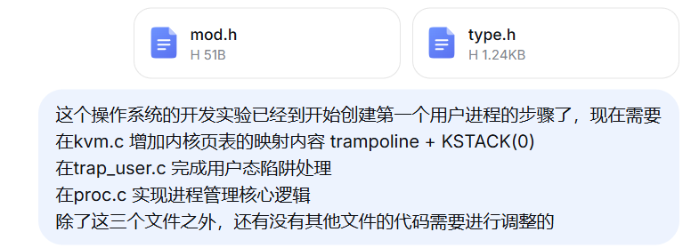

再次开始编写这个文档已经过去六个小时了，这六个小时里面一直没有进展，在用ds给的代码进行测试的过程中，系统始终不能从内核态切换到用户态。

好了，又过去了四个多小时，今天过去的十几个小时，我感觉一直看不太懂的代码马上都快背下来了，果然，看不懂就是看的不够多。调试的过程中，通过了各种办法确定过程的正确与否，比如验证用户表是否正确的建立了，用户表的地址映射对不对，加载用户进程的地址有没有传入寄存器，各种地址偏移量的计算正不正确，地址有没有在写入寄存器的时候被改变导致错误，甚至都直接把存入寄存器的地址写死了，都没有用。以下是使用ds进行的大概总结。

#### 尝试的方向与结果

1. **硬件启动与核心初始化**  
   - 验证 `entry.S` → `start.c` → `main.c` 流程正常，双核启动成功。  
   - 物理内存分配器 `pmem_init` 工作正常，内核页表 `kvm_init` 建立正确。
2. **第一个用户进程创建**  
   - 分配用户物理页，拷贝 `initcode`（或硬编码 `test_code`）。  
   - 建立用户页表，映射代码页（虚拟地址 0）、栈页、`TRAMPOLINE`、`TRAPFRAME`。  
   - 填充 `trapframe`，设置 `sepc=0`，`sp`，`a0=TRAPFRAME`。  
   - 页表项打印显示权限正确（`PTE_R|PTE_X|PTE_U`）。
3. **用户态切换实现**  
   - `trap_user_return` 设置 `sstatus`（清零 `SPP`，置位 `SPIE`），`sepc`，`stvec`（指向 `user_vector`），调用 `user_return`。  
   - `user_return` 切换用户页表，设置 `sscratch=TRAPFRAME`，恢复通用寄存器，执行 `sret`。
4. **调试手段**  
   - 添加 `uart_putc_sync` 打印，确认执行点。  
   - 打印关键寄存器值（`sstatus`、`sepc`、`satp`、`stvec`）。  
   - 打印物理页内容（验证二进制正确）。  
   - 打印页表项（验证映射权限）。  
   - 强制设置 `sepc=TRAMPOLINE` 测试 `user_vector`。  
   - GDB 单步调试，观察 `sret` 后 PC 跳转。  
   - 添加 `fence.i` 刷新指令缓存。
5. **发现并修正的问题**  
   - `TRAPFRAME` 宏值计算正确（`0x3FFFFFE000`），但汇编中硬编码曾出错，已修正。  
   - `user_vector` 中访问 UART 的调试代码导致页错误，已移除。  
   - `user_return` 中 `a0` 参数未正确传递，强制设置 `a0=TRAPFRAME` 解决。  
   - `user_return` 中 `sepc` 被覆盖，删除硬编码，让 `trap_user_return` 设置。
6. **核心未解决问题**  
   - `sret` 后 PC 未跳转到预期地址（`0` 或 `TRAMPOLINE`），而是跳转到 `0x3ffffff094`（偏移 +0x94），导致立即异常，无法执行用户程序或 `user_vector`。  
   - GDB 单步显示 `sepc` 设置正确（`0` 或 `TRAMPOLINE`），但 `sret` 实际跳转偏离，可能因 `sstatus.SPP` 或 `sstatus` 其他位设置不当，或 QEMU 模拟器对 `sret` 的实现存在 bug。  
   - 添加 `-d int,mmu` 日志观察，仍无法确定根本原因

#### 问题终于解决

在经历了两天所有的尝试之后，还是找不到原因，然后我就借助了一下舍友的**agent**（**agent**还是NB），让它把整个**lab-4**都重新做了一遍，然后我直接拿来先测试，一遍就跑通了，然后我就赶紧分析，看看代码到底有什么区别啊，看一圈下来，结论就是区别不大，毕竟我的也是让**ds**参考xv6实现的，就功能逻辑上，都没有问题，那么问题出现在哪呢，**执行流**上，我之前的代码执行流上，缺少了从内核主栈切换到进程内核栈的关键步骤，就是通过`swtch`完成的上下文切换，这会导致什么呢，就出现了进程返回时的跳转错误问题，其实我在这两天的测试过程中也找到了跳转错误的问题，但是一直没有解决掉它，其实一开始读文档和代码的时候，我也看到已经给了上下文切换的这个功能，我还以为是留到后面用的，没想到啊，但凡我想到这个，当时多问**ds**一句，咱都不用花那么长时间。好了，下面是让**ds**对这两天的工作的整个总结。

经过长时间的调试和对比，现将整个过程总结如下：

#### 一、所有尝试的方向

1. **物理内存与页表验证**

- 打印物理页内容，确认用户程序二进制正确（`93080000...`）

- 验证虚拟地址 0、`TRAMPOLINE`、`TRAPFRAME` 的 PTE 权限

- 确认所有映射均包含 `PTE_U` 和正确的读写执行权限

2. **特权级与寄存器检查**

- 打印 `sstatus`、`sepc`、`stvec`、`satp`，确认清零 SPP、设置 SPIE、`sepc=0` 正确
- 在 `sret` 前检查 `sepc=0`，确认目标地址正确
- 验证 `stvec` 指向 `TRAMPOLINE + (user_vector - trampoline)`

3. **trampoline 汇编调试**

- 修改 `user_return`，强制硬编码 `a0=TRAPFRAME`、`sscratch=TRAPFRAME`
- 简化 `user_return`，只保留切换页表和 `sret`
- 在 `user_vector` 开头添加调试打印（但触发页错误后移除）
- 在 `sret` 前强制写入 `sepc=0`

4. **GDB 单步跟踪**

- 跟踪 `trap_user_return` 执行到调用 `user_return`
- 跟踪 `user_return` 切换页表、执行 `sret`
- 观察 `sret` 后 `PC` 跳转目标（始终为 `0x3FFFFFF090`，而非 `0x0`）

5. **QEMU 日志分析**

- 启用 `-d cpu,mmu,int` 日志
- 发现 `sepc` 在 `sret` 时被设置为 `0x3FFFFFF000`（`user_vector` 地址）

6. **对比正确与错误代码**

- 正确版本：使用 `swtch` 切换到进程上下文
- 错误版本：直接调用 `trap_user_return`

7. **其他尝试**

- 添加 `fence.i` 刷新指令缓存
- 检查 QEMU 版本和编译器优化
- 检查 `kernel.ld` 中 `trampsec` 段对齐

#### 二、错误原因分析

**根本原因**

**缺少 `swtch` 上下文切换，导致 `trap_user_return` 执行时仍使用主核的内核栈**，而非进程专属的内核栈。当用户程序触发 `ecall` 后，`user_vector` 需要从 `trapframe` 恢复内核栈指针（`tf->user_to_kern_sp`），但由于主核栈和进程栈的错乱，`sp` 指向无效地址，导致后续操作崩溃并进入死循环。

**具体表现**

1. 直接调用 `trap_user_return()` 是在主核栈上执行 `sret`
2. 用户程序执行 `ecall` 后，`user_vector` 尝试从 `trapframe` 加载内核栈指针（`ld sp, 8(a0)`）
3. 由于主核栈上下文与进程上下文不匹配，`sp` 被覆盖为错误值
4. 后续 `jr t0` 跳转时，栈指针错误，导致访问无效地址
5. `stvec` 指向 `user_vector`，页错误后再次跳回，形成无限循环

**解决方案**

通过 `swtch` 切换到进程的上下文，确保 `sp` 指向进程的内核栈，再执行 `trap_user_return`。这样 `sret` 返回用户态后，`user_vector` 能正确恢复内核栈指针，正常处理 `ecall`。

#### 三、结论

前三个文件**功能逻辑正确**，但**执行流有误**：缺少从内核主栈切换到进程内核栈的关键步骤。后三个文件通过 `swtch` 完成了这一切换，确保了 `trap_user_return` 在正确的栈上执行，从而解决了死循环问题。核心教训在于：**用户进程的返回和后续的 `ecall` 处理必须在进程专属的内核栈上进行，否则上下文错乱导致不可预测的行为。**

## 九
